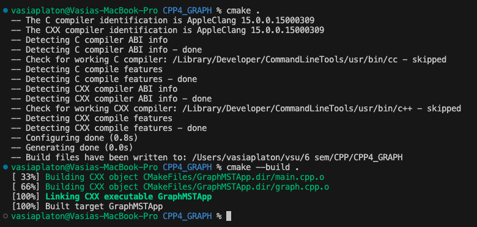
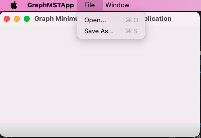

Задание 4
Разработать MFC-приложение, используя библиотеку классов stl

	Общие требования к реализации:
1. Ядро приложения работает с использованием контейнеров и алгоритмов STL
2. Отсутствие С-конструкций в коде (использование вместо них конструкций С++)
3. Удобный интерфейс на базе MFC (QT, GDK…)
4. Система логирования, сохраняющая всю активность приложения и пользователя в файл формата (время, важность, текст сообщения)
5. Обработка исключений, защита от дурака


Неориентированный граф задан в файле в виде списков инцидентных вершин. Считать его в память. Представление в памяти – также в виде списков инцидентных вершин. Найти остовное дерево графа и сохранить в файл в том же формате. Для нахождения остовного дерева можно, например, на каждом шаге выбирать дугу, соединяющую уже просмотренную вершину с еще не просмотренной. 


# Разработано
1. Класс graph, реализующий все необходимые функции.  
[graph.cpp](graph.cpp) [graph.h](graph.h)

2. MFC приложение
[mfc-main.cpp](mfc-main.cpp)

3. Для запуска у меня на mac также UI с использованием __wxwidgets__
[main.cpp](main.cpp)

# Пример работы
### 1. Создаем файл results/graph.txt
```
6
0 1
0 2
1 3
1 4
2 4
3 5
4 5
```

Там у нас вот такой граф
```
    0
   / \
  1   2
 / \  |
3   4
 \ / 
  5
```

### 2. Собираем и запускаем приложение с помощью cmake



### 3. Открываем graph.txt, далее сохраняем минимальное оставное дерево как results/output.txt
Резульат
```
6
0 1
0 2
1 3
1 4
3 5
```

лог файл[log.txt](log.txt)
```
[INFO] Graph successfully read from file
[INFO] Minimum spanning tree found
[INFO] Minimum spanning tree successfully written to file
```

### Вышел какой-то граф для исходного
```
    0
   / \
  1   2
 / \
3   4
 \
  5
```

